# 🌙 Night Navigator

> **AI-powered safe routing for Bangalore — because peace of mind matters more than minutes.**

Night Navigator is an open-source navigation system that introduces **Psychological Safety** as a first-class routing metric. Unlike conventional tools that optimize solely for ETA, Night Navigator computes a multi-dimensional safety score for every road segment and routes travellers — especially solo commuters and women travelling at night — along paths that minimise anxiety rather than just distance.

Built on open street data, classical machine learning, and graph-search algorithms, the system exposes a production-ready **FastAPI** backend and a **Leaflet.js** map frontend, making it both a functional prototype and a scalable engineering reference.

---

## Table of Contents

- [Key Results](#key-results)
- [Architecture Overview](#architecture-overview)
- [Project Structure](#project-structure)
- [Tech Stack](#tech-stack)
- [Prerequisites](#prerequisites)
- [Environment Setup](#environment-setup)
- [Running the Pipeline](#running-the-pipeline)
- [Running the Application](#running-the-application)
- [ML Training & Evaluation (Optional)](#ml-training--evaluation-optional)
- [How the Safety Score Works](#how-the-safety-score-works)
- [AI & Agentic Layer](#ai--agentic-layer)
- [Limitations](#limitations)
- [Future Work](#future-work)
- [Troubleshooting](#troubleshooting)

---

## Key Results

| Metric | Value |
|---|---|
| Average safety gain over fastest route | **+22.7%** |
| Average distance overhead | **+34.3%** |
| XGBoost model R² | **0.9973** |
| Edge-match rate (graph ↔ safety scores) | **100%** |
| Road network size (Bangalore) | 393k edges, 35k POIs, 135 police stations |

---

## Screenshots

### Map View — Navigate Safely
Enter origin, destination, and optional stops. The Guardian Route (cyan) is displayed alongside the standard fastest path (dashed grey), with live safety metrics in the bottom bar.

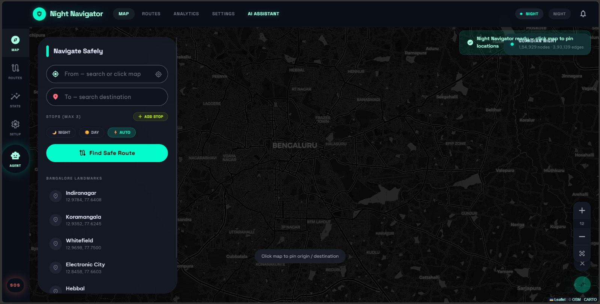

### Map View — Landmark Quick-Select & Route Overlay
The sidebar lists pre-loaded Bangalore landmarks for one-tap routing. The top-right badge confirms the loaded graph: 1,54,929 nodes · 3,93,139 edges.

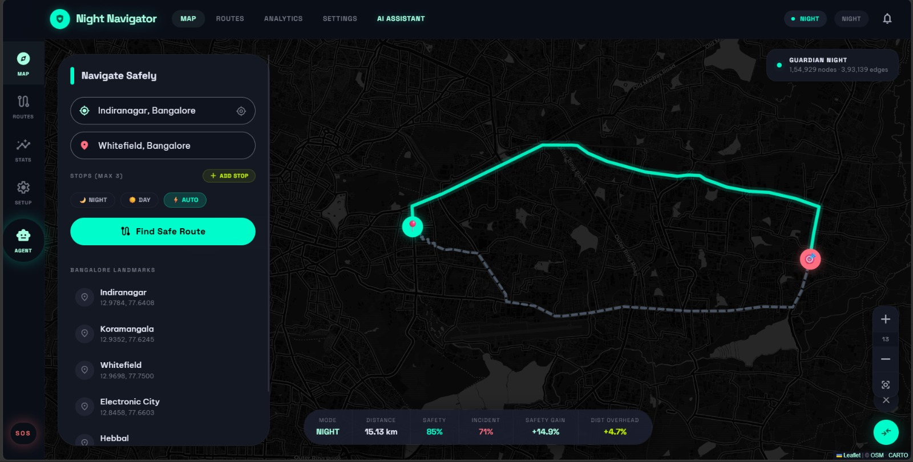

### Routes — Guardian Path vs Standard Path Comparison
Side-by-side comparison of the safety-optimised **Guardian Path** (score 85, distance 15.13 km) against the **Standard Path** (score 74, distance 14.45 km), with overall safety gain (+14.9%) and distance overhead (+4.7%) summarised at the bottom.

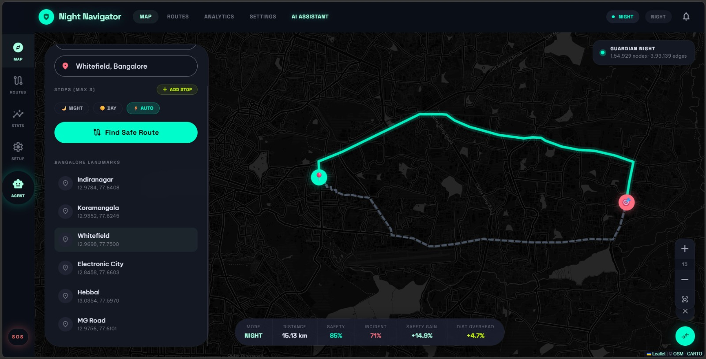

### Routes — Guardian Path Selected
The Guardian Path card highlighted after selection, showing safety score, distance, and incident risk at a glance, with a "Deep Safety Analysis" link for further drill-down.

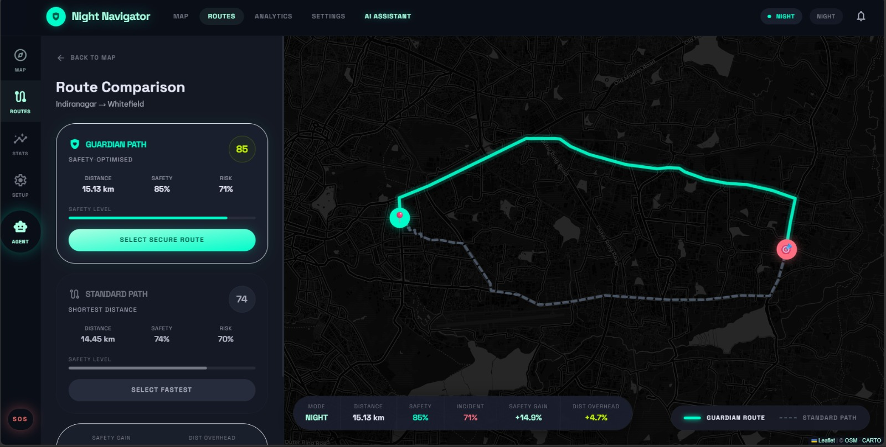

### Analytics — Safety Analytics Dashboard
Live safety score distribution across all 3,93,139 road segments in the Bangalore OSM graph, broken into Day and Night distributions with mean, standard deviation, and skewness statistics.

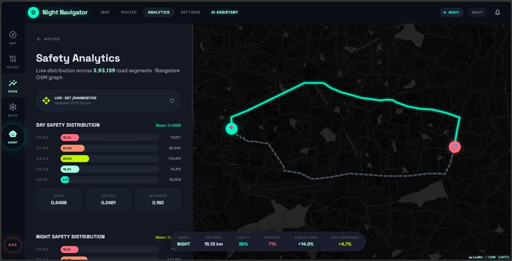

### Analytics — Night Safety Distribution & Area Scores
Night-mode safety histogram (mean 0.4444) alongside per-area safety scores for key Bangalore neighbourhoods, colour-coded from red (high risk) to green (safer).

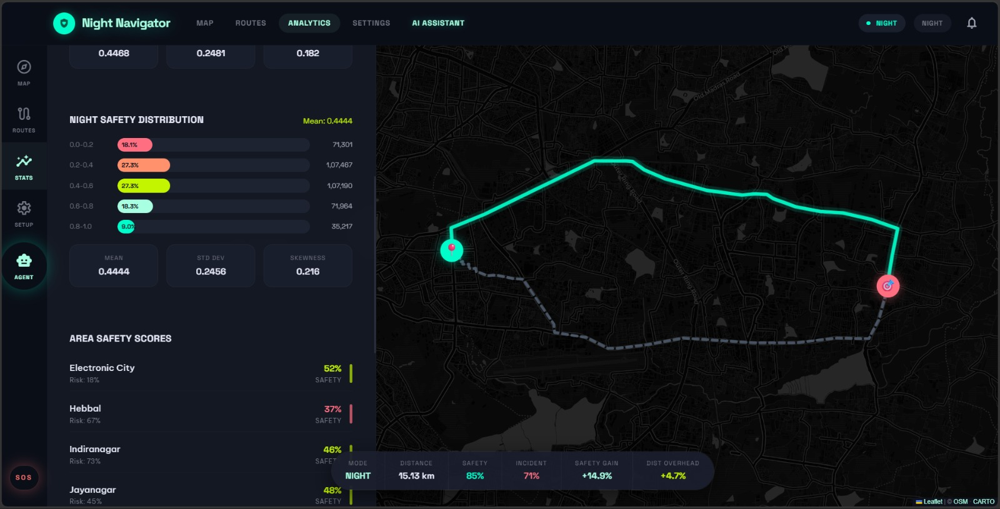

### Analytics — Area Safety Scores Detail
Expanded area-level breakdown showing safety percentages and incident risk for Electronic City, Hebbal, Indiranagar, Jayanagar, Koramangala, M.G. Road, Whitefield, and Yeshwanthpur.

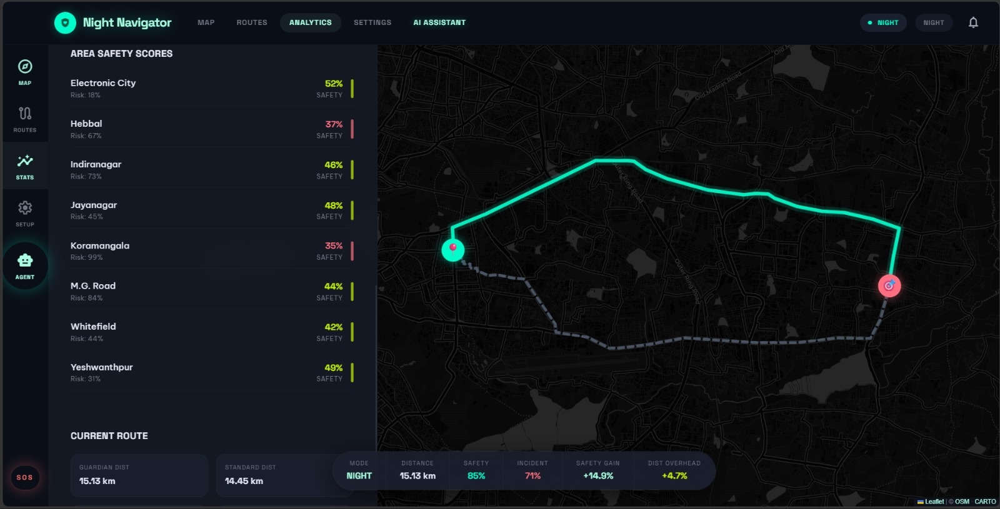

### Analytics — Current Route Stats Panel
Detailed stats for the active route: Guardian distance vs standard distance, average safety score, incident risk, safety gain, and routing mode — all in one panel.

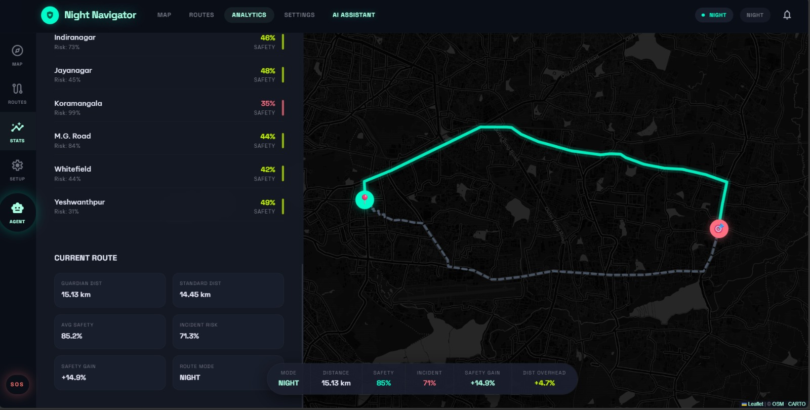

### Settings — Guardian Settings (Routing Mode & Path Avoidance)
Configure routing mode (Auto / Night / Day) and toggle path-avoidance rules: Avoid Alleys, Avoid Unlit Parks, Avoid Industrial zones, and Avoid Congestion.

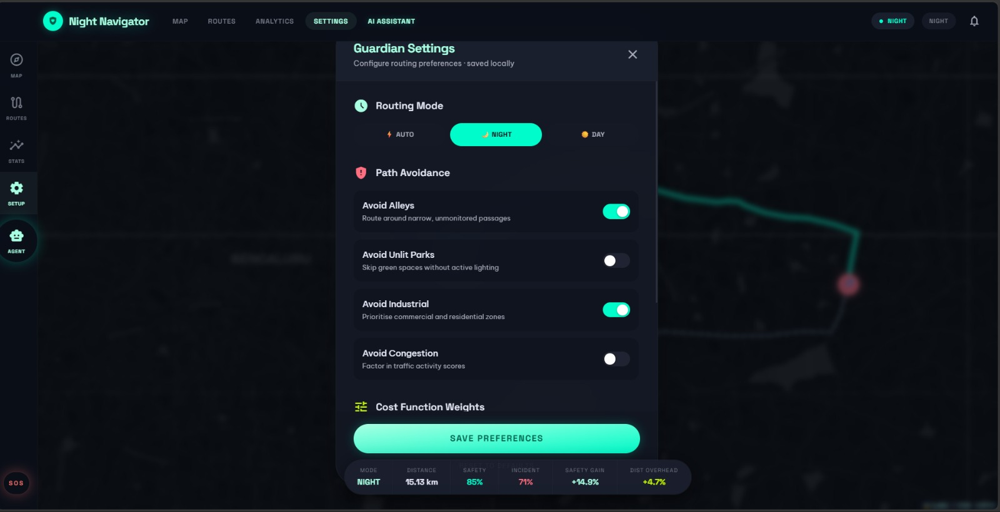

### Settings — Cost Function Weights & API Endpoint
Adjust the Safety Weight (β) slider to shift routing from speed-first to safety-first. Also configure a custom FastAPI backend URL for self-hosted deployments.

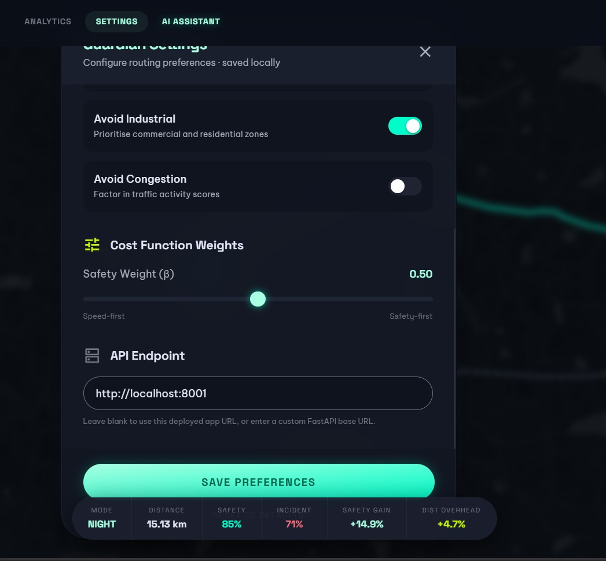

### AI Assistant — Natural Language Route Request
Type or speak a natural-language query (e.g. *"Find a safe route from Indiranagar to Koramangala and alert me of any recent crimes"*). The LangGraph supervisor parses intent and orchestrates route computation + incident search in parallel.

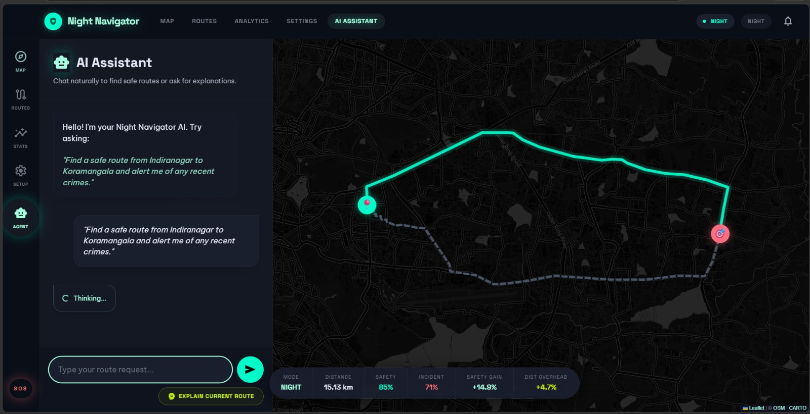

### AI Assistant — Safety Explanation Response
The AI explains why a route is safe in plain language, citing SHAP-derived feature weights: street lighting (lamp_norm, weight 0.4) and activity levels (activity_composite, weight 0.3) dominate the safety score.

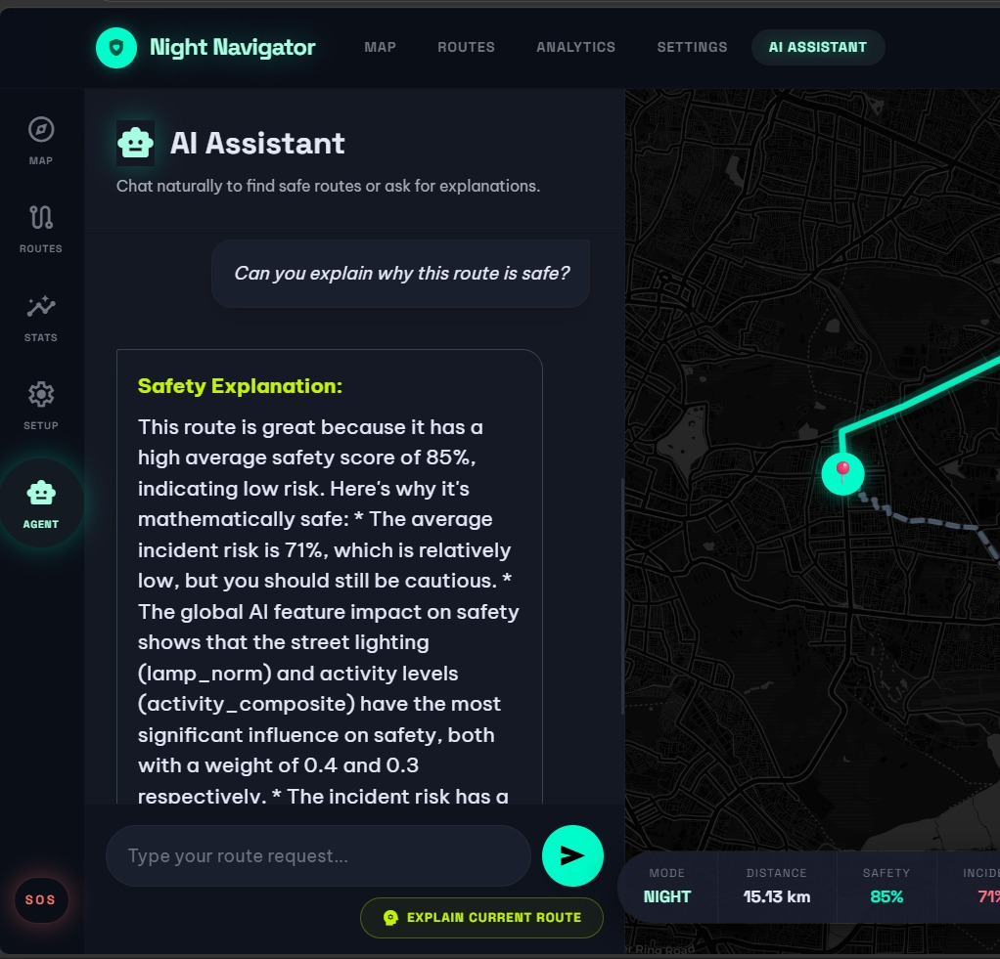

### AI Assistant — Scrolled Explanation View
Continued explanation showing incident risk (weight 0.2) and police presence bonus (weight 0.1), with the route map visible alongside the chat.

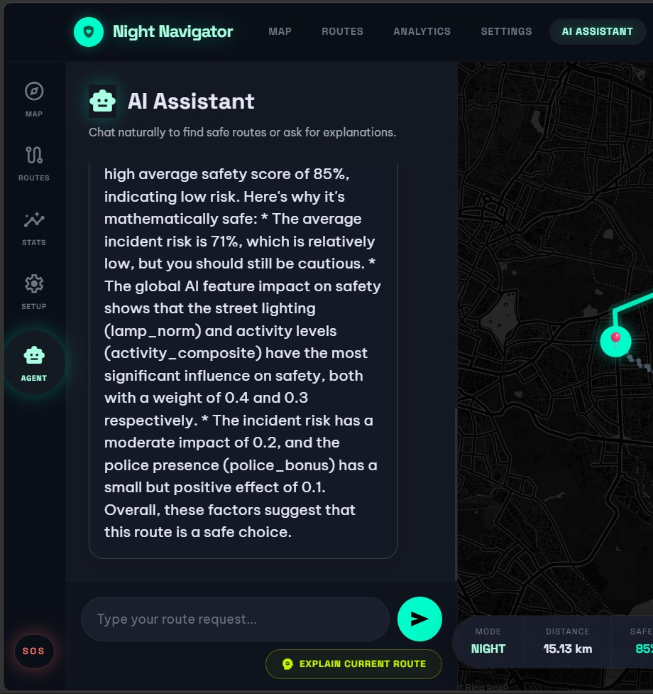

### SOS — Emergency Alert Modal
One-tap SOS button (bottom-left of every screen) triggers an Emergency Alert modal with options to **Call 112** or **Share My Location** with emergency contacts.


### Multi-Stop Routing — Waypoint Support
Add up to 3 intermediate stops on a single journey. Here: Indiranagar → A1 Dry Cleaners (waypoint) → Whitefield, with the full Guardian Route rendered on the map.

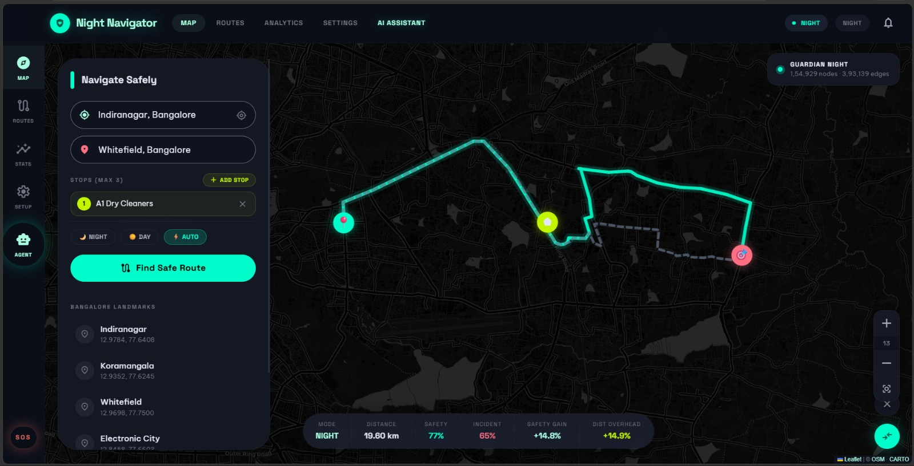

---

## Architecture Overview

```
User Request
     │
     ▼
FastAPI Backend ──────────────────────────────────────────┐
     │                                                     │
     ├── LangGraph Supervisor (LLM intent parsing)         │
     │       ├── Agent 1: Route Planning                   │
     │       ├── Agent 2: Real-time Incident Search        │
     │       └── Agent 3: Safety Metric Explanation        │
     │                                                     │
     ├── A* Router (NetworkX / OSMnx graph)                │
     │       └── Cost = α × distance + β × safety_penalty  │
     │                                                     │
     └── Safety Score Engine                               │
             ├── Rule-based composite formula              │
             └── XGBoost / Random Forest (R² 0.9973)       │
                                                           │
Leaflet.js Frontend ◄──────────────────────────────────────┘
```

---

## Project Structure

```
night-navigator/
├── agents/
│   ├── agent1.py                   # LangGraph route agent (parse → geocode → route → summarize)
│   └── agent2.py                   # LangGraph alert agent (crime intel + hospital lookup)
│
├── api/
│   └── main.py                     # FastAPI application entry point
│
├── data/
│   ├── bangalore_graph.graphml     # OSMnx road network graph
│   ├── Banglore_traffic_Dataset.csv
│   ├── edges.geojson               # Road edges (OSMnx)
│   ├── edges_with_safety.geojson   # Safety-enriched edges (output of scorer)
│   ├── nodes.geojson
│   ├── pois.geojson                # Points of interest
│   ├── lamps.geojson               # Street lamp data
│   ├── police_stations.geojson
│   ├── wards_369.geojson           # Bangalore ward polygons
│   ├── ward_streetlights.csv       # Streetlight counts per ward
│   ├── traffic_area_scores.csv
│   ├── traffic_night_scores.csv
│   └── routing_test_results.json
│
├── evaluation/
│   ├── evaluate.py                 # 20-pair OD evaluation suite + ablation study
│   ├── results.json
│   ├── safety_distribution.png
│   └── routing_scatter.png
│
├── extraction/
│   └── osm_extractor.py            # Downloads OSM road network, POIs, lamps
│
├── frontend/
│   └── index.html                  # Leaflet.js map interface
│
├── models/
│   └── train_safety_model.py       # XGBoost / Random Forest training + SHAP plots
│
├── preprocessing/
│   └── traffic_preprocessor.py     # Computes area-level safety scores from traffic data
│
├── routing/
│   └── safe_router.py              # A* safe routing + comparison vs shortest path
│
├── scoring/
│   └── safety_scorer.py            # Enriches road edges with composite safety scores
│
├── screenshots/                    # UI screenshots (referenced above)
├── .env.example                    # Environment variable template
├── requirements.txt
└── README.md
```

---

## Tech Stack

| Layer | Technology |
|---|---|
| Backend API | Python 3.10+, FastAPI, Uvicorn |
| Graph Routing | NetworkX, OSMnx |
| Machine Learning | Scikit-Learn (Random Forest), XGBoost, SHAP |
| Agentic Orchestration | LangChain, LangGraph |
| LLM Providers | Groq (Llama-3.1 8B), Mistral via OpenRouter |
| Real-time Search | Tavily Search API |
| Geocoding | Geopy (Nominatim) |
| Spatial Processing | GeoPandas, SciPy (cKDTree) |
| Frontend | Leaflet.js, HTML/CSS/JS |

---

## Prerequisites

Ensure the following are installed before proceeding:

- **Python 3.10 or higher** — [python.org/downloads](https://www.python.org/downloads/)
- **pip** (bundled with Python 3.4+)
- **Git** — [git-scm.com](https://git-scm.com/)

> A virtual environment is strongly recommended to avoid dependency conflicts.

---

## Environment Setup

### 1. Clone the Repository

```bash
git clone https://github.com/DEVESH859/Night-navigator.git
cd Night-navigator
```

### 2. Create and Activate a Virtual Environment

**macOS / Linux:**
```bash
python3 -m venv .venv
source .venv/bin/activate
```

**Windows (Command Prompt):**
```cmd
python -m venv .venv
.venv\Scripts\activate.bat
```

**Windows (PowerShell):**
```powershell
python -m venv .venv
.venv\Scripts\Activate.ps1
```

### 3. Install Python Dependencies

```bash
pip install -r requirements.txt
```

If you don't have a `requirements.txt`, install core packages directly:

```bash
pip install osmnx geopandas networkx numpy pandas scipy xgboost scikit-learn shap \
            fastapi uvicorn langchain langchain-groq langgraph \
            geopy tavily-python python-dotenv requests
```

> **Linux only:** OSMnx requires `libspatialindex`:
> ```bash
> sudo apt-get install libspatialindex-dev
> ```
>
> **Windows:** If `pip install osmnx` fails, use conda instead:
> ```bash
> conda install -c conda-forge osmnx
> ```

> **Heads up:** OSMnx downloads Bangalore's road network on first run (~393k edges). This may take 5–15 minutes. The result is cached locally for subsequent runs.

### 4. Configure API Keys

Copy the example environment file and populate it with your credentials:

```bash
cp .env.example .env
```

Open `.env` and fill in:

```env
# LLM provider — free tier at console.groq.com
GROQ_API_KEY="your_groq_api_key_here"

# Web search for real-time incident data — app.tavily.com
TAVILY_API_KEY="your_tavily_api_key_here"

# Mistral fallback via OpenRouter — openrouter.ai
OPENROUTER_API_KEY="your_openrouter_api_key_here"

# Optional: internal API base URL for agent-to-API calls
NIGHT_NAVIGATOR_INTERNAL_BASE_URL=""
```

| Key | Required | Where to Obtain |
|---|---|---|
| `GROQ_API_KEY` | ✅ Yes | [console.groq.com](https://console.groq.com) — free tier |
| `TAVILY_API_KEY` | ⚠️ Optional | [app.tavily.com](https://app.tavily.com) — enables live crime intel |
| `OPENROUTER_API_KEY` | ⚠️ Optional | [openrouter.ai](https://openrouter.ai) — LLM fallback only |

---

## Running the Pipeline

Run these steps in order the **first time** to build all data and scores. Steps 1–3 only need to run once.

### Step 1 — Extract OSM Data

Downloads the Bangalore road network, POIs, and street lamp data from OpenStreetMap.

```bash
python extraction/osm_extractor.py
```

**Output:** `data/bangalore_graph.graphml`, `data/edges.geojson`, `data/nodes.geojson`, `data/pois.geojson`, `data/lamps.geojson`

---

### Step 2 — Preprocess Traffic Data

Computes per-area safety scores from the Bangalore traffic dataset.

```bash
python preprocessing/traffic_preprocessor.py
```

**Input:** `data/Banglore_traffic_Dataset.csv`  
**Output:** `data/traffic_area_scores.csv`, `data/traffic_night_scores.csv`

---

### Step 3 — Score Road Edges

Enriches every road edge with day/night safety scores using a weighted composite formula.

```bash
python scoring/safety_scorer.py
```

**Input:** `data/edges.geojson`, `data/pois.geojson`, `data/wards_369.geojson`, `data/ward_streetlights.csv`, `data/police_stations.geojson`, `data/Banglore_traffic_Dataset.csv`  
**Output:** `data/edges_with_safety.geojson`

---

### Step 4 — Run Safe Router (CLI Test)

Compares shortest-path vs safest-path routing for test OD pairs. You will be prompted to enter custom coordinates or press Enter for the default Bangalore pairs.

```bash
python routing/safe_router.py
```

**Output:** Printed comparison table + `data/routing_test_results.json`

---

### Step 5 — Run Evaluation Suite

Runs the full benchmark: 20 random OD pairs, ablation study, and distribution plots.

```bash
python evaluation/evaluate.py
```

**Output:** `evaluation/results.json`, `evaluation/safety_distribution.png`, `evaluation/routing_scatter.png`

---

## Running the Application

### Start the Backend API

```bash
python -m uvicorn api.main:app --port 8000 --reload
```

The API is available at `http://localhost:8000`.  
Interactive Swagger docs are auto-generated at `http://localhost:8000/docs`.

**Example route request:**

```bash
curl -X POST http://localhost:8000/route \
  -H "Content-Type: application/json" \
  -d '{"origin": [12.9784, 77.6408], "destination": [12.9352, 77.6245], "mode": "night"}'
```

### Open the Frontend

```bash
cd frontend
python -m http.server 3000
```

Navigate to `http://localhost:3000` in your browser.

---

## ML Training & Evaluation (Optional)

The pre-computed safety scores and trained models are included in the repository. Run these steps only to retrain from scratch or reproduce evaluation benchmarks.

### Retrain the Safety Model

```bash
python models/train_safety_model.py
```

Trains both **XGBoost** and **Random Forest** regressors on the feature-engineered dataset, outputs SHAP explainability plots, and saves serialised models to `models/`.

### Run the Routing Evaluation Suite

```bash
python evaluation/evaluate.py
```

Tests 20 random origin-destination pairs across Bangalore, computes safety gain and distance overhead for each, and prints a summary table alongside the ablation study.

---

## How the Safety Score Works

Each road segment receives a **Safety Score** between 0 and 1, computed in three stages.

### Stage 1 — Feature Engineering

| Feature | Source | Description |
|---|---|---|
| `poi_norm` | OSMnx (300 m buffer) | Normalised count of nearby POIs (shops, restaurants, etc.) as a footfall proxy |
| `lamp_norm` | Ward-level streetlight CSV (198 wards) | Lamp density per km, robust-normalised (p2–p98 clip); missing wards imputed with median |
| `road_importance` | OSM highway class + traffic dataset | Dynamic blend of road type, pedestrian density, and activity score |
| `incident_risk` | Traffic incident dataset (8,936 rows) | Area-level historical risk, aggregated and mapped to edges |
| `police_bonus` | OSMnx (police stations) | Distance-decayed bonus (max 5%) for proximity to a police station within 1 km |

### Stage 2 — Composite Formula

**Night Safety Score:**

```
raw_night = 0.40 × lighting_score
          + 0.25 × footfall_score
          + 0.15 × activity_composite
          − 0.10 × crime_score
          + police_bonus

safety_score_night = robust_percentile_norm(raw_night, clip=[0.01, 0.99])
```

Scores are robust-normalised (2nd–98th percentile clipping) to prevent outliers from collapsing the distribution. Day scores use a similar formula with reduced lighting weight (0.30) and higher footfall weight.

### Stage 3 — ML Replication

An **XGBoost** regressor (R² = 0.9973) is trained to predict the composite score from raw features. This enables fast on-edge scoring of new roads without re-running the full feature pipeline, and supports future on-device deployment.

### A* Routing Cost Function

```
edge_cost = α × (length_m / max_length) + β × (1 − safety_score)
```

Default weights: `α = 0.50`, `β = 0.50`. Adjusting these shifts the trade-off from pure speed (α → 1, β → 0) to maximum safety (α → 0, β → 1). The β slider is exposed in the Settings UI.

---

## AI & Agentic Layer

The system employs three AI mechanisms:

**1. Rule-based Safety Scoring** — A deterministic formula encoding domain knowledge: well-lit, busy roads near police stations are safer; dark, quiet, high-incident roads are penalised. This acts as the ground truth signal.

**2. Supervised ML (XGBoost & Random Forest)** — Trained to replicate the safety score with near-perfect fidelity. Synthetic data augmentation (5,000 statistically distributed rows) ensures the model generalises beyond spatial biases in real data. SHAP values provide full explainability.

**3. LangGraph Agentic Orchestration** — A LangGraph supervisor parses natural-language queries and routes intent to specialist sub-agents:
- **Agent 1** — handles route computation (parse intent → geocode → call API → generate summary)
- **Agent 2** — searches Tavily for real-time incident reports near the route + hospital lookup
- **Agent 3** — explains specific safety metrics in plain language using SHAP feature importance

Both agents use a multi-LLM fallback chain: **Groq** (5 models, Llama-3.1 8B primary) → **OpenRouter** (4 models, Mistral fallback), with thread-level timeouts preventing stalls.

---

## Limitations

- **Ward-level lighting granularity** — A well-lit main road and a dark alley within the same ward share the same lamp density value. Street-level lighting data would improve accuracy significantly.
- **Partial incident coverage** — The traffic dataset covers only 8 areas of Bangalore; incident risk is extrapolated to all edges via spatial interpolation.
- **Static incident risk** — The model uses historical incident data with no live feed. Real-time updates (Waze, police APIs) would make routing dynamic.
- **Bangalore-only** — The graph, proxy variables, and model weights are specific to Bangalore's road network. Deployment in other cities requires retraining on local data.

---

## Future Work

- Integrate real-time crime and accident APIs (SafeCity, police open data portals) to update safety scores dynamically.
- Use street-view imagery (Google Street View or Mapillary) with computer vision to estimate lighting and footfall directly from photographs.
- Deploy the XGBoost model on-device via TensorFlow Lite or CoreML for offline scoring without an internet connection.
- Expand to other Indian cities (Delhi, Mumbai, Chennai) by retraining on local OSM data and region-specific proxy sources.
- Add a user feedback loop — allow travellers to flag roads where they "felt unsafe", feeding a collaborative safety signal back into the model.

---

## Troubleshooting

| Error | Fix |
|---|---|
| `FileNotFoundError: bangalore_graph.graphml` | Run `extraction/osm_extractor.py` first |
| OSMnx timeout or download error | Overpass API can be slow — wait a few minutes and retry |
| `Groq API rate limit or timeout` | Set `OPENROUTER_API_KEY`; the agent auto-falls back to all providers |
| `A* failed, falling back to shortest path` | Expected for disconnected OD pairs — fallback ensures the app never crashes |
| `pip install osmnx` fails on Windows | Use conda: `conda install -c conda-forge osmnx` |
| `libspatialindex` missing on Linux | Run `sudo apt-get install libspatialindex-dev` |

---

## Re-running from Scratch

To regenerate everything from scratch after data changes:

```bash
python extraction/osm_extractor.py
python preprocessing/traffic_preprocessor.py
python scoring/safety_scorer.py
python routing/safe_router.py
python evaluation/evaluate.py
```

---

## Contributing

Pull requests are welcome. For major changes, please open an issue first to discuss what you would like to change.

---

## License

This project is open source. See [LICENSE](LICENSE) for details.  
All OSM data is © OpenStreetMap contributors under the ODbL license.
